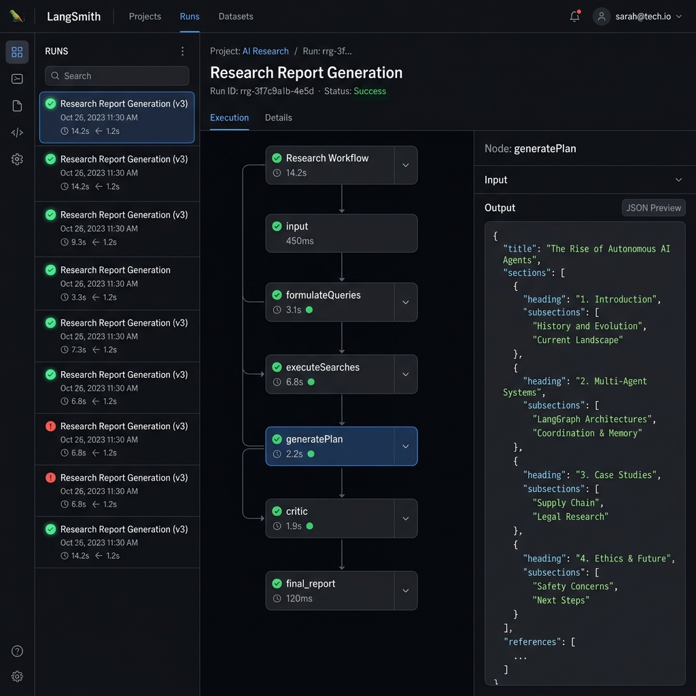
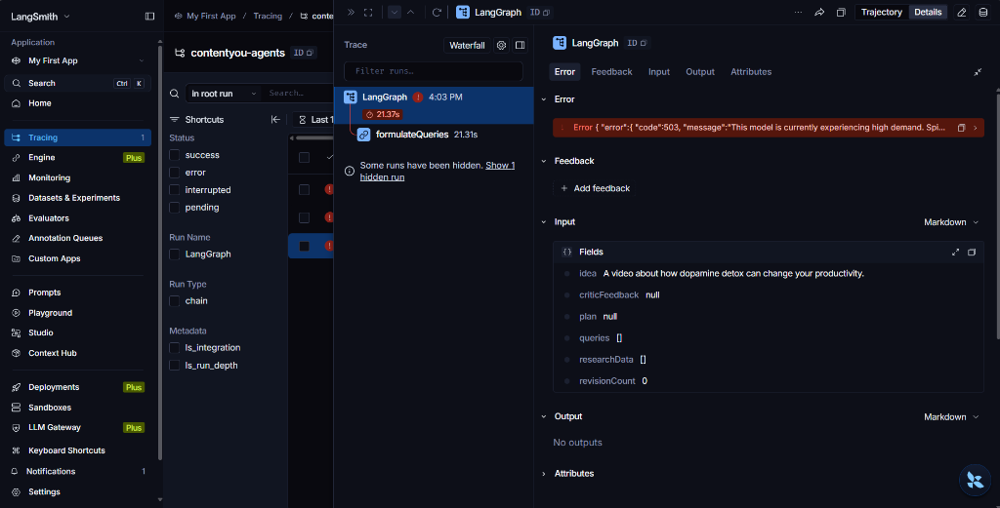
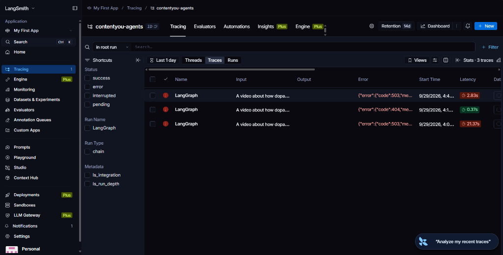

# Autonomous Content Pipeline (ContentYou)

Welcome to the **Autonomous Content Pipeline**, a state-of-the-art, multi-agent AI system designed to automate end-to-end content creation, research, planning, and publishing across various digital platforms.

Powered by **LangGraph**, **Google Gemini**, and a robust monorepo architecture, this pipeline autonomously synthesizes viral content ideas, conducts deep-web research, critiques its own output, and transforms concepts into highly engaging cross-platform artifacts (YouTube Shorts, LinkedIn posts, Instagram Reels, etc.).

---

## 🚀 Features

- **Multi-Agent Orchestration**: Utilizes LangGraph to power a stateful, cyclic orchestration graph. Specialized agents handle specific node tasks (formulating queries, executing searches, planning, critiquing).
- **Dynamic AI Model Routing**: Intelligently mixes and matches LLMs based on task complexity. Lightweight tasks run on fast `flash` models, while deep synthesis tasks are escalated to heavy-duty `pro` reasoning models.
- **Self-Reflective Loop**: A built-in "Critic Agent" validates all generated content against rubrics and mandates citations, forcing the generation agent to revise until quality standards are met.
- **Deep Observability**: Fully integrated with **LangSmith** for granular tracing of LLM prompts, agent states, and token usage metrics.

### Observability in Action
LangSmith integration gives you a live dashboard of your autonomous graph.

**Successful Workflow Execution:**


**Live Traces Tracking Errors (e.g., API Load):**



- **Scalable Monorepo Architecture**: Built with Turborepo to encapsulate logic securely into modular domains (Schemas, AI, DB, Skills, UI, Scheduling).

---

## 🏗️ Architecture

This repository is structured as a scalable monorepo. 

### Apps
- `apps/agent`: The core backend process orchestrating the autonomous LangGraph workers and AI clients.
- `apps/web`: The user-facing dashboard and control center.

### Packages
- `@contentyou/ai`: Centralized AI client wrapper handling model calls, retries, and API boundaries.
- `@contentyou/schemas`: Shared Zod validators, TypeScript entities, and interface ports (LlmPort, UsageLedgerPort, etc.).
- `@contentyou/db`: Database connection and abstraction layer.
- `@contentyou/skills`: The registry and executor for specific artifact generation strategies (e.g., YouTube Long, X Threads).
- `@contentyou/scheduling`: Calendar and automated social publishing integrations.
- `@contentyou/ui`: Shared React components and design system.
- `@contentyou/config`: Shared toolchain configurations (TypeScript, ESLint).

---

## 🛠️ Prerequisites

To run this pipeline, you will need the following tools and credentials:

- **Node.js** (v18+)
- **pnpm** (Package manager)
- **MongoDB** (Local instance or Atlas cluster)
- **Google Gemini API Key**
- **LangSmith API Key** (Optional, but highly recommended for observability)

---

## ⚙️ Setup & Installation

**1. Clone the repository and install dependencies:**
```bash
git clone <repository-url>
cd autonomous-content-pipeline
pnpm install
```

**2. Configure Environment Variables:**
Create a `.env` file in the root of the project with the following keys:
```env
NODE_ENV=development
APP_URL=http://localhost:3002
MONGODB_URI=mongodb://localhost:27017/contentyou
GEMINI_API_KEY="your-gemini-api-key"

# LangSmith Tracing
LANGCHAIN_TRACING_V2="true"
LANGCHAIN_ENDPOINT="https://api.smith.langchain.com" # Change if in APAC/EU region
LANGCHAIN_API_KEY="your-langsmith-api-key"
LANGCHAIN_PROJECT="contentyou-agents"
```

**3. Typecheck the Workspace:**
Ensure all packages and apps are correctly typed and linked:
```bash
pnpm run typecheck
```

---

## 🏃‍♂️ Usage

To execute a test run of the multi-agent planning workflow:

```bash
cd apps/agent
npx tsx test-agent.ts
```

This will initiate a test pipeline on a sample idea (e.g., "Dopamine detox for productivity"). You can monitor the live execution, the agent's web searches, the self-critique loop, and the final JSON generation directly via your CLI, or by opening your LangSmith dashboard.

---

## 🧪 How It Works (The Pipeline)

1. **Formulate**: The system converts a raw string idea into 3 highly targeted search queries.
2. **Search**: The queries are executed across the web (via DuckDuckGo scrape) to retrieve factual citations and inspiration.
3. **Plan**: A Pro-tier LLM synthesizes the research into a highly structured JSON `Plan` with citations attached to every claim.
4. **Critique**: A Critic LLM validates the plan. If citations are missing or the hook is weak, the state loops back to the **Plan** step with feedback, executing up to a bounded maximum number of revisions.
5. **Execution**: The approved plan is passed to the **Skill Registry** to be generated into targeted formats (Tweets, LinkedIn posts, etc.).

---

## 🤝 Contributing
Maintain architectural boundaries when contributing. Interfaces and types belong in `@contentyou/schemas`. Cross-package implementations must rely strictly on defined ports to ensure dependency inversion.

## 📄 License
Private and Confidential.
