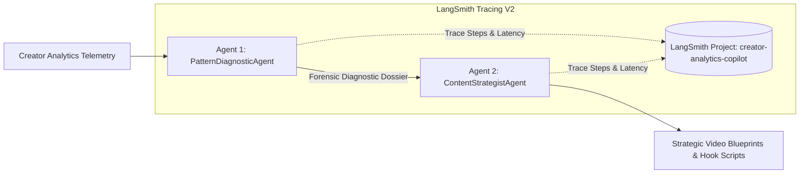

# 🎬 Creator Analytics Copilot — YouTube Studio Edition

> **Assigned Problem No.:** 24  
> **Application Name:** Creator Analytics Copilot  
> **Assigned Branch:** `24_Creator_Analytics_Copilot`  
> **Student:** Bhuvanashree K R  

---

## 📌 Problem Statement & Build Challenge

* **Problem Statement:** Creators have performance data in YouTube Studio but struggle to understand *why* some content works better.
* **Core Workflow / Build Challenge:**  
  $$\text{Upload Content Analytics} \longrightarrow \text{Identify Patterns} \longrightarrow \text{Explain What Worked} \longrightarrow \text{Recommend Next Content Ideas}$$

---

## 🌟 Key Features

### 1. YouTube Studio Native Interface
* Designed and structured in the **exact look, feel, and navigation of YouTube Studio (`studio.youtube.com`)**.
* Includes the collapsible sidebar navigation, channel identity, top studio app bar, and search tools.

### 2. The 4-Step Copilot Pipeline
1. **📤 Upload Content Analytics & Channel Telemetry:**
   * Ingest YouTube Studio CSV/JSON exports (video metrics, watch duration, impressions, and retention curves) or choose verified benchmarks (*TechPulse 184K*, *CapitalMind Finance 92K*, *LoreCraft Gaming 410K*).
   * Displays primary YouTube Studio KPI tiles with sparklines and trend indicators.
2. **🔍 Identify Patterns (Key Moments for Audience Retention):**
   * Head-to-Head interactive SVG audience retention curve comparing top outlier hits vs underperforming flops across **Intro (0:00 - 0:30)**, **Continuous segments**, and **Climax**.
   * Second-by-second cursor scrubber with hover deltas.
   * Clickable forensic drop-off hotspots (*0:24 Hook Cliff*, *2:40 Pacing Drag*, *6:15 Thermal Stress Spike*).
   * Pearson $r$ Browse Feature recommendation correlation matrix.
3. **🧠 Explain What Worked ("The Why" — Algorithmic Causal Diagnoses):**
   * Plain-English causal explanations of why the YouTube recommendation engine pushed content to Browse Features (Home Feed) or dropped it.
   * Diagnostic prescriptions for pacing, hook mechanics, and audience expectation fulfillment.
4. **💡 Recommend Next Content Ideas (Prescriptive Video Blueprints):**
   * Data-backed video concepts generated from the channel's winning retention DNA.
   * Each blueprint includes Title A/B options, thumbnail composition guide, full **60-second opening hook script**, and retention arc.
   * One-click copy and export to Markdown/Notion.

### 3. 🦜️ LangChain & LangSmith Multi-Agent Architecture (Minimum 2 Agents)
The platform integrates an autonomous multi-agent pipeline built with **LangChain** and monitored with **LangSmith Tracing V2**:



* **🔍 Agent 1: `PatternDiagnosticAgent` (Forensic Analytics Specialist):**
  * **Role:** Analyzes audience retention drop-offs, click-through rates, and algorithmic distribution patterns to explain *why* specific videos outperformed while others underperformed.
  * **LangChain Tools:**
    * `analyze_retention_curves`: Forensically segments retention into Intro (0:00–0:30), Continuous watching, and Climax, detecting drop-off hotspots.
    * `evaluate_browse_correlation`: Calculates Browse Velocity score ($r = +0.78$ with YouTube Home impressions).
    * `detect_outlier_patterns`: Contrasts top 10% outlier videos against bottom 10% underperformers to extract core causal drivers.
* **🎨 Agent 2: `ContentStrategistAgent` (Creative Blueprint & Script Architect):**
  * **Role:** Consumes Agent 1's diagnostic evidence and formulates high-conversion video blueprints, title variations, thumbnail composition plans, and 60-second opening hook scripts.
  * **LangChain Tools:**
    * `score_title_clickability`: Evaluates curiosity gaps, emotional stakes, and cognitive load (5–9 words benchmark).
    * `generate_hook_script`: Structures 60-second retention shield scripts (Visual Anchor $\rightarrow$ Problem Escalation $\rightarrow$ Stakes & Payoff $\rightarrow$ First Value Delivery).
* **🛠️ `CopilotOrchestrator` & LangSmith Tracing:**
  * Coordinates sequential multi-agent execution with complete run telemetry.
  * Provides conversational routing for creator inquiries (routing metric questions to Agent 1 and creative questions to Agent 2).
  * Automatically instruments all agent runs with `@traceable` for LangSmith observability.

### 4. YouTube Title & Thumbnail Clickability Lab
* Real-time pre-production sandbox evaluating curiosity gaps, clickability velocity, and suggesting 3 high-converting title rewrites.

### 5. Channel Growth & Revenue ROI Calculator
* Interactive sliders for Monthly Views, CTR, Average View Duration, and RPM with live projected view and ad revenue lifts.

### 6. Multi-Mode Implementation
* **Web Edition (Standalone HTML/CSS/JS):** Open [`index.html`](index.html) directly in any modern browser with zero dependencies, complete with live LangChain agent runner simulation!
* **Python/Streamlit Edition:** Complete Streamlit analytics dashboard in [`app.py`](app.py) powered by LangChain, LangSmith tracing, and full pytest suite.

---

## 🛠️ Tech Stack

* **Agents & LLM Framework:** LangChain (`langchain`, `langchain-core`, `langchain-community`, `langchain-google-genai`), LangSmith (`langsmith`)
* **Frontend:** HTML5 Semantic Structure, Vanilla CSS3 (YouTube Studio Dark Theme), Vanilla JavaScript (ES6+)
* **Data Visualization:** Custom Interactive SVG Curve Generator, Canvas Scrubber, Plotly
* **Python Engine:** Streamlit, Pandas, NumPy, Pydantic, Python-Dotenv
* **Testing:** Pytest, AnyIO

---

## 🚀 How to Run Locally

### Option A: YouTube Studio Web Application (Recommended, Zero Dependencies)
1. Navigate to the repository root directory.
2. Open [`index.html`](index.html) directly in any web browser (Chrome, Edge, Firefox, Brave):
   ```bash
   # On Windows (PowerShell):
   Start-Process index.html
   ```
3. Or serve using Python's built-in HTTP server:
   ```bash
   python -m http.server 3030
   # Open http://localhost:3030 in your browser
   ```

### Option B: Streamlit Dashboard with LangChain & LangSmith
1. Create and activate a virtual environment:
   ```bash
   python -m venv .venv
   .\.venv\Scripts\activate
   ```
2. Install Python dependencies:
   ```bash
   pip install -r requirements.txt
   ```
3. Configure environment variables in `.env` (optional for live LangSmith tracing & Gemini):
   ```bash
   cp .env.example .env
   # Set LANGCHAIN_API_KEY and GEMINI_API_KEY
   ```
4. Run the Streamlit app:
   ```bash
   streamlit run app.py
   ```
5. Run automated tests (23 passed):
   ```bash
   pytest
   ```

---

## 📁 Repository Structure

```text
├── index.html                  # Main YouTube Studio Web Application (with Multi-Agent Brain)
├── styles.css                  # YouTube Studio Dark Mode design system
├── app.js                      # Client-side analytics, SVG curves, & Agent runner
├── assets/
│   ├── hero-dashboard.jpg      # Dashboard visualization asset
│   ├── sample_data.csv         # Sample YouTube performance metrics
│   └── style.css               # Streamlit custom styling
├── app.py                      # Streamlit application with LangChain & LangSmith
├── src/                        # Python analytics engine modules
│   ├── agents/                 # LangChain Multi-Agent System
│   │   ├── __init__.py
│   │   ├── tools.py            # LangChain @tool definitions (retention, browse, clickability, hooks)
│   │   ├── pattern_diagnostic_agent.py # Agent 1 (Causal forensics & retention)
│   │   ├── content_strategist_agent.py # Agent 2 (Blueprints & 60s hook scripts)
│   │   └── orchestrator.py     # Pipeline supervisor & LangSmith tracing coordinator
│   ├── analytics.py            # KPI & statistical pattern detection
│   ├── config.py               # Platform constants & LangSmith configuration
│   ├── loader.py               # Multi-format CSV/Excel parser
│   ├── mapping.py              # Canonical column auto-mapper
│   └── ui.py                   # Custom Streamlit UI components
├── tests/                      # Automated test suite
│   ├── test_agents.py          # LangChain tools, agents, and orchestrator tests
│   ├── test_analytics.py       # Deterministic analytics tests
│   └── test_loader.py          # Data ingestion & schema tests
├── requirements.txt            # Python dependencies (including LangChain & LangSmith)
├── .env.example                # LangSmith & Gemini environment configuration
└── README.md                   # Comprehensive project documentation
```

---

## 👤 Author
**Bhuvanashree K R**  
Assigned Problem: `24_Creator_Analytics_Copilot`
