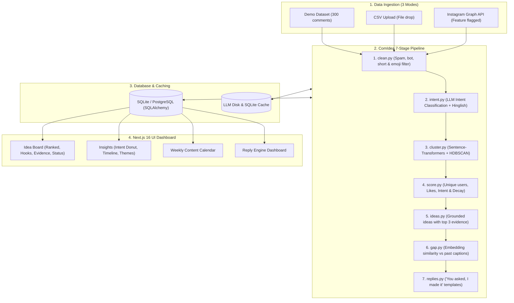

# ComIdea — Comment-to-Content Engine for Creators 🚀

[](https://fastapi.tiangolo.com)
[](https://nextjs.org)
[](https://www.typescriptlang.org)
[](https://tailwindcss.com)
[](https://sbert.net)
[](https://www.anthropic.com)

> Creators miss viral content ideas hidden inside audience comments. **ComIdea** converts audience comments into ranked, ready-to-shoot post and video ideas — each strictly backed by evidence from actual audience comments.

---

## 🌟 Instagram-First Key Features

1. **Instagram-Native Content Output**:
   - **Reels**: First 3-second hook, suggested video duration (e.g., 30s/45s/60s), and on-screen text overlay for the first frame.
   - **Carousels**: Slide-by-slide blueprints (5–8 slides) with slide numbers, titles, visual mockups, and text content.
   - **Stories**: Interactive poll or question sticker prompts designed to validate audience appetite before filming.
   - **Production Captions & Hashtags**: Ready-to-post Instagram captions with 5–8 targeted hashtags and Story shoutouts.
2. **Instagram-Specific Pipeline Signals**:
   - **Demand Scoring**: Weights unique commenters, comment likes (log-dampened), reply counts (discussion threads), and friend @mentions (shareability).
   - **Request Detection**: Detects patterns such as `"part 2"`, `"tutorial"`, `"kaise kiya"`, `"next video mein"`, `"link?"`, and `"which app?"`.
   - **Friend @Mentions**: Flags `@friend` mentions as a viral shareability signal (boosting topic demand by 1.3x).
   - **Emoji Intent Interpretation**: Accurately classifies confusion (🤔, ❓, 🤯, 😭) vs praise (🔥, ❤️, 👏, 🚀, 💯).
   - **Hinglish & Multilingual Support**: Seamlessly parses mixed-language creator comments without losing intent.
3. **Post-Level Analysis**:
   - Stores `post_id`, `post_format` (reel, carousel, image), and captions.
   - **Insights Matrix**: Correlates post formats with comment types (e.g., Carousels trigger 3.2x more technical architecture questions; Reels drive 78% of "Part 2" requests and friend @mentions).
4. **Instagram Creator Workflows**:
   - **Validate with a Story**: One-click interactive 9:16 mobile simulator preview with copyable sticker prompts and story-mention captions.
   - **"You Asked, I Made It" Reply Desk**: Personalized comment replies and Story shoutouts tagging commenters who requested the topic.
   - **Content Calendar**: Track ideas across `new` -> `saved` -> `planned` -> `posted` states on an interactive calendar.
5. **Realistic Demo Data & Safe Compliance**:
   - Seeded with 18 realistic creator posts across mixed formats and 300 comments reflecting real engagement.
   - **Strict Meta Compliance**: Official Instagram Graph API connector is feature-flagged strictly for the creator's own authenticated account. No account scraping is implemented. Demo and CSV upload operate 100% offline.

---

## 🏗️ System Architecture



---

## 🛠️ Tech Stack

- **Frontend**: Next.js 16 (App Router), TypeScript, Tailwind CSS v4, Lucide React, Recharts
- **Backend**: FastAPI (Python 3.11), Pydantic v2, Uvicorn
- **Database**: SQLite (SQLAlchemy ORM, swappable to PostgreSQL)
- **ML / NLP**: `sentence-transformers` (`paraphrase-multilingual-MiniLM-L12-v2`), `HDBSCAN`, `scikit-learn`
- **LLM**: Anthropic Claude SDK (`claude-3-7-sonnet-20250219`), with persistent caching and offline heuristic fallback
- **Validation**: Strict Pydantic models for all LLM structured outputs with automatic retry on parse errors

---

## 🚀 Quick Start Guide

### 1. Prerequisites
- Python 3.11+
- Node.js 18+ and npm

### 2. Environment Configuration
Copy `.env.example` to `.env`:
```bash
cp .env.example .env
```
Configure your environment variables:
```env
ANTHROPIC_API_KEY=your_anthropic_api_key_here
ANTHROPIC_MODEL=claude-3-7-sonnet-20250219
PORT=8000
HOST=0.0.0.0
DATABASE_URL=sqlite:///./comidea.db
ENABLE_INSTAGRAM_GRAPH_API=false
```
*(Note: If `ANTHROPIC_API_KEY` is not provided, ComIdea operates seamlessly using its built-in grounded heuristic engine and persistent cache so you can test all features offline without cost.)*

### 3. Install Dependencies

**Backend:**
```bash
python -m pip install -r backend/requirements.txt
```

**Frontend:**
```bash
cd frontend
npm install
cd ..
```

### 4. Run Both Services Simultaneously

You can launch both the FastAPI backend and Next.js frontend with any of the following:

**Using npm:**
```bash
npm run dev
```

**Using Makefile:**
```bash
make dev
```

**On Windows (Batch script):**
```bash
run_dev.bat
```

- **Frontend Application**: [http://localhost:3000](http://localhost:3000)
- **Backend API Docs (Swagger UI)**: [http://localhost:8000/docs](http://localhost:8000/docs)
- **API Health Check**: [http://localhost:8000/api/health](http://localhost:8000/api/health)

---

## 📂 Repository Layout

```
Forge/
├── backend/
│   ├── app/
│   │   ├── config.py              # App settings & environment loader
│   │   ├── db.py                  # SQLAlchemy engine & session maker
│   │   ├── models.py              # DB models (Job, RawComment, Cluster, Idea, etc.)
│   │   ├── schemas.py             # Pydantic validation & response schemas
│   │   ├── main.py                # FastAPI app entry point & CORS
│   │   ├── pipeline/              # 7-stage ML & LLM pipeline
│   │   │   ├── clean.py           # Spam, bot & duplicate filtering
│   │   │   ├── intent.py          # LLM intent classification (Hinglish aware)
│   │   │   ├── cluster.py         # Sentence-Transformers + HDBSCAN / KMeans
│   │   │   ├── score.py           # Multi-factor demand scoring (0-100)
│   │   │   ├── ideas.py           # Grounded idea generation with evidence
│   │   │   ├── gap.py             # Content gap similarity check vs past posts
│   │   │   ├── replies.py         # "You asked, I made it" response templates
│   │   │   └── runner.py          # Pipeline orchestrator with stage progress
│   │   ├── routers/
│   │   │   ├── ingest.py          # Demo & CSV ingestion, Instagram status
│   │   │   ├── analyze.py         # Pipeline execution & job polling
│   │   │   ├── ideas.py           # Ranked ideas with evidence & status updates
│   │   │   ├── clusters.py        # Discovered theme clusters
│   │   │   ├── insights.py        # Donut charts, top themes, timeline metrics
│   │   │   ├── calendar.py        # Scheduling & calendar events
│   │   │   └── replies.py         # Creator reply drafts
│   │   └── services/
│   │       ├── cache.py           # Persistent SQLite LLM cache
│   │       ├── llm.py             # Anthropic SDK client with retries & validation
│   │       └── instagram_connector.py # Stubbed connector behind feature flag
│   ├── data/
│   │   ├── demo_comments.json     # 300 realistic creator comments (English + Hinglish)
│   │   └── sample_comments.csv    # Sample CSV file for testing upload
│   ├── scripts/
│   │   └── generate_demo_data.py  # Seed data generation script
│   ├── tests/
│   │   └── test_pipeline.py       # End-to-end pipeline verification test
│   └── requirements.txt
├── frontend/
│   ├── src/
│   │   ├── app/
│   │   │   ├── layout.tsx         # Root layout with dark mode class & fonts
│   │   │   ├── page.tsx           # Main dashboard (Board, Insights, Calendar, Replies)
│   │   │   └── globals.css        # Tailwind v4, glassmorphism, design tokens
│   │   ├── components/
│   │   │   ├── Navbar.tsx         # Responsive navbar, health badge, theme toggle
│   │   │   ├── IngestModal.tsx    # Source picker (Demo, CSV, Instagram)
│   │   │   ├── IdeaCard.tsx       # Idea card with evidence expander & actions
│   │   │   ├── ScheduleModal.tsx  # Production calendar scheduler
│   │   │   ├── RepliesModal.tsx   # Reply preview & copy modal
│   │   │   ├── InsightsView.tsx   # Donut charts, timeline & KPI cards
│   │   │   ├── CalendarView.tsx   # Weekly content calendar board
│   │   │   ├── RepliesView.tsx    # "You asked, I made it" replies dashboard
│   │   │   └── icons.tsx          # Clean SVG icons
│   │   ├── lib/
│   │   │   └── api.ts             # Strongly-typed API client
│   │   └── types/
│   │       └── index.ts           # Data contracts & interfaces
│   └── package.json
├── scripts/
│   └── start_dev.js               # Concurrent dev server starter
├── .env.example
├── Makefile
├── run_dev.bat
└── README.md
```

---

## 📡 API Endpoints Reference

| Method | Endpoint | Description |
|---|---|---|
| `POST` | `/api/ingest/demo` | Seeds 300 realistic creator comments into the database |
| `POST` | `/api/ingest/csv` | Uploads and parses user-supplied CSV comments |
| `GET` | `/api/ingest/instagram/status` | Checks Instagram Graph API connection & prerequisites |
| `POST` | `/api/analyze` | Triggers the 7-step pipeline in the background; returns `job_id` |
| `GET` | `/api/jobs/{id}` | Polls job progress (0–100%), stage name, and execution stats |
| `GET` | `/api/ideas` | Returns ranked ideas with supporting comments & reply drafts |
| `GET` | `/api/ideas/{id}` | Returns details of a specific idea |
| `POST` | `/api/ideas/{id}/status` | Updates idea status (`new`, `saved`, `planned`, `posted`) |
| `GET` | `/api/clusters` | Returns discovered themes with demand scores and metrics |
| `GET` | `/api/insights` | Returns intent distribution, top themes, and timeline data |
| `GET` | `/api/calendar` | Lists scheduled posts on the content calendar |
| `POST` | `/api/calendar` | Schedules an idea on a specific date with optional notes |
| `DELETE` | `/api/calendar/{id}` | Removes a post from the calendar |
| `GET` | `/api/replies` | Returns drafted "You asked, I made it" replies |
| `GET` | `/api/health` | Health check endpoint |

---

## 🧪 Testing the Pipeline

To run the automated end-to-end backend pipeline test:
```bash
python backend/tests/test_pipeline.py
```
This runs the full 7-step pipeline on all 300 demo comments, validates cluster discovery, confirms that demand scores are properly normalized, ensures that every idea has verified supporting comments, and checks reply draft generation.

---

## 📄 License
MIT License. Built for creators and developers.
