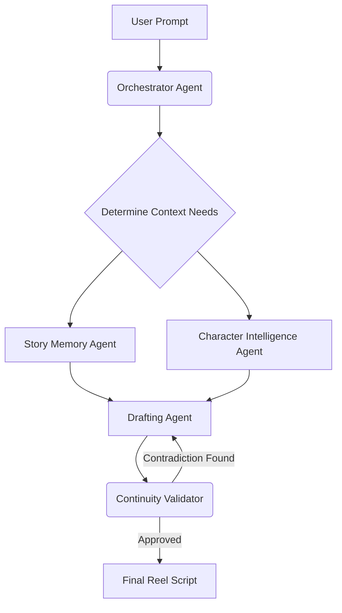

# Agentic AI Writer's Room for Instagram Storytelling

## 1. Vision & Core Identity
**Vision Statement:** A multi-agent AI writer's room for Instagram creators that autonomously manages story canon, character continuity, emotional arcs, and scene progression, enabling consistent episodic Reel storytelling rather than simple AI text generation.

**The Problem:** Existing AI writing tools operate as single-prompt generators. They lack persistent memory of the universe, characters, emotional states, and past events. Creators are forced to manually track continuity and repeatedly prompt the AI with massive context.

**The Solution:** An agentic ecosystem where an "Orchestrator" analyzes requests and delegates tasks to specialized agents (Character, Memory, World, Continuity). The AI becomes a co-writer that understands the canonical rules of the creator's universe.

---

## 2. Unique Selling Propositions (USPs)
What makes this project stand out from ChatGPT or existing screenplay tools?

- **Dynamic Story Bible (Canon Knowledge Graph):** Every generated scene updates a persistent graph. Characters, props, and relationships are nodes; events are edges. It’s a living memory, not just static notes.
- **Canon Lock (Immutability):** Creators can lock facts (e.g., "Maya has a phobia of water"). If a future generated script contradicts this, the Continuity Validator blocks it and rewrites the scene.
- **Emotional Arc Tracker:** The system tracks multi-episode emotional states. If Episode 4 ends with tension, Episode 5 starts with cold dialogue automatically.
- **Reel Structure Agent:** Generates scripts mapped precisely to Instagram's retention mechanics (0-3s Hook, Setup, Conflict, Twist, Cliffhanger) tailored to a 45-second duration.
- **Continuity Validator (The Critic):** An agent that doesn't write, but *reads* the generated draft against the Canon DB to find plot holes or character inconsistencies before showing it to the user.

---

## 3. Agentic Workflow
The system uses a stateful **Multi-Agent Graph (LangGraph)** rather than a simple sequential chain.

### The Agents:
1. **Orchestrator Agent (Project Manager):** Receives the user prompt ("Continue the library scene from Ep 6"). Determines the required state and delegates to sub-agents.
2. **Story Memory Agent:** Queries the vector database to retrieve summaries of Episode 5 and 6, and recent events in the "Library".
3. **Character Intelligence Agent:** Retrieves personality profiles, current emotional states, and speaking styles of the involved characters.
4. **Drafting Agent (The Writer):** Uses the compiled context to draft the screenplay formatted for an Instagram Reel.
5. **Continuity Validator (The Director):** Reviews the draft. If it finds a continuity error (e.g., "Arjun is holding a coffee, but he spilled it in Ep 6"), it sends it back to the Drafting Agent with a correction note.

### Typical Workflow Execution:

---

## 4. Technology Stack

### Frontend
- **Next.js (App Router):** Fast, SEO-friendly React framework for building the workspace UI.
- **Tailwind CSS:** For sleek, premium styling and micro-animations.
- **Framer Motion:** For dynamic interactions and smooth transitions.

### Backend & AI
- **FastAPI (Python):** High-performance backend to handle agent orchestration.
- **LangGraph:** The core framework for building the stateful, multi-actor agent workflows.
- **LLM:** Qwen 3 (or OpenAI GPT-4o / Claude 3.5 Sonnet) for the reasoning and generation engine.

### Databases (The Memory Layer)
- **MongoDB:** Primary database for user accounts, projects, and structured metadata.
- **ChromaDB / Pinecone:** Vector database for semantic retrieval of past scenes and dialogues (RAG).
- **Neo4j (Knowledge Graph):** Maps relationships (e.g., Character A -> Hates -> Character B) to maintain strict canon.

---

## 5. Development Phases

### Phase 1: Foundation (MVP)
- Set up Next.js frontend and FastAPI backend.
- Create Project and Character CRUD operations.
- Implement basic RAG (Retrieval-Augmented Generation) using ChromaDB to retrieve past scene contexts.
- Build the Drafting Agent.

### Phase 2: The Agentic Engine
- Migrate the backend to a LangGraph multi-agent architecture.
- Introduce the Orchestrator and Character Intelligence agents.
- Implement the Reel Structure Agent to format outputs.

### Phase 3: The "WOW" Features (Hackathon/Evaluator focus)
- Implement the Continuity Validator with an iterative feedback loop.
- Integrate Neo4j for the Dynamic Story Bible and Canon Lock.
- Add the Emotional Arc Tracker.

### Phase 4: Polish & Presentation
- Refine the UI for a premium "Apple/Vercel" aesthetic.
- Ensure micro-animations are smooth.
- Prepare a demo scenario highlighting a complex continuity resolution.
