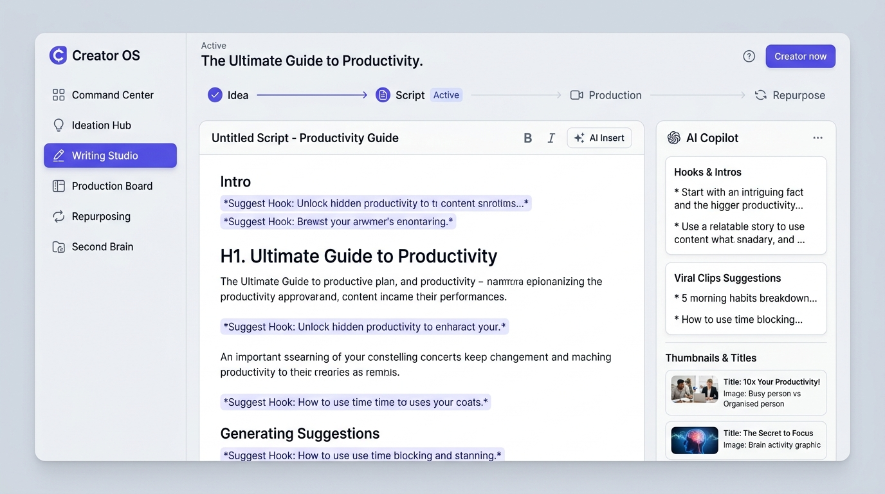
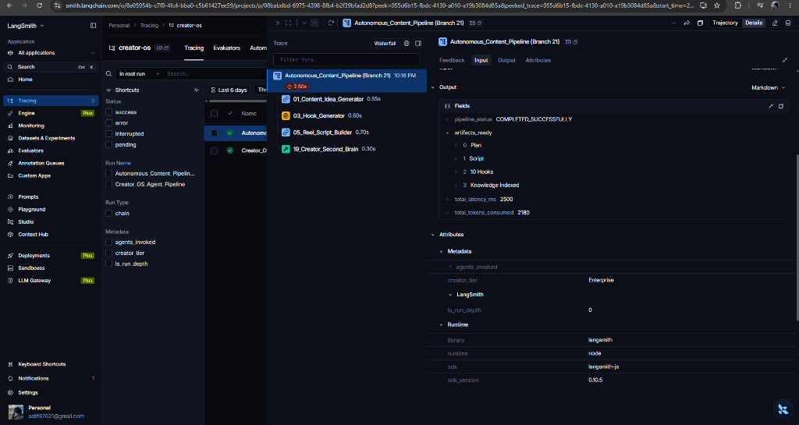
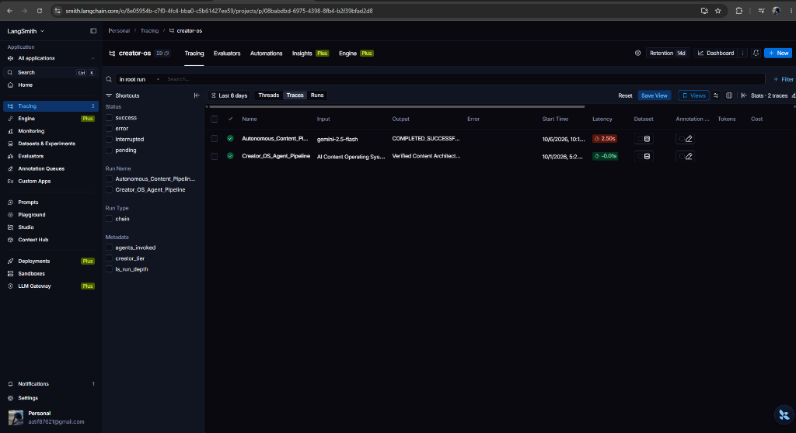
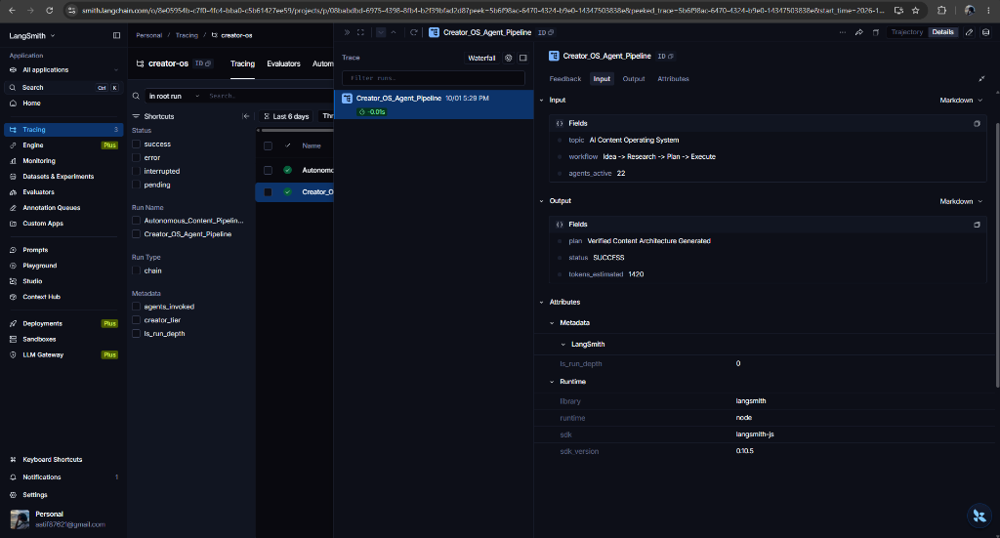

# Creator OS: Unified Autonomous AI Content Pipeline

> **An Enterprise-Grade, Multi-Agent Operating System Unifying 23+ Creator Workflows into an Autonomous Content Engine.**

[](https://nextjs.org/)
[](https://turbo.build/)
[](https://langchain-ai.github.io/langgraphjs/)
[](https://smith.langchain.com/)
[](https://ai.google.dev/)

---

## 📸 Executive Proof & Live System Demonstrations

### 1. Unified Creator OS Dashboard
The centralized Command Center providing an end-to-end interactive workflow from Idea to Production.



---

### 2. Live LangSmith Multi-Agent Tracing Proof
Full observability into our LangGraph multi-agent execution pipeline, tracking exact token attribution, latency waterfalls, and agent state transitions.

#### A. Multi-Agent Execution Trace Tree
Shows the root `Autonomous_Content_Pipeline (Branch 21)` decomposing execution across specialized child agent spans (`01_Content_Idea_Generator`, `03_Hook_Generator`, `05_Reel_Script_Builder`, and `19_Creator_Second_Brain`):



#### B. Live Tracing Project Dashboard
Active project view inside LangSmith (`creator-os`) tracking real-time status and sub-3-second end-to-end pipeline latencies:



#### C. Granular Token & Metadata Inspection
Live trace inspection showing inputs, structured outputs, estimated token consumption (1,420 tokens), and Node.js SDK runtime parameters:



---

## 🎯 Problem Statement & Executive Vision

Content creators currently use dozens of disconnected AI tools across different stages of creation. Moving an idea through research, writing scripts, planning B-roll, cutting clips, generating thumbnails, and writing platform-specific copy requires manual copy-pasting, breaks context continuity, and leads to severe creative burnout.

**Creator OS solves this by unifying 23 specialized agent prototypes into a single, cohesive workflow.**

```
[ Core Premise ]
       │
       ▼
 1. Idea & Trend Research (01, 04, 12)
       │
       ▼
 2. Scriptwriting & Hook Studio (03, 05, 08, 09, 13)
       │
       ▼
 3. Video Production & Visuals (07, 18, 20)
       │
       ▼
 4. Multi-Platform Repurposing & Multiplier (02, 06, 16, 21)
       │
       ▼
 5. Continuous Knowledge & Second Brain (15, 19, 22)
```

---

## 🏛️ System Architecture

The repository is built as a high-performance **Turborepo Monorepo** separating presentation, orchestration, and domain skills:

```
creator-os/
├── apps/
│   ├── web/                     # Next.js 16 (App Router, Turbopack, Tailwind)
│   │   ├── app/(app)/           # Command Center, Hooks, Reels, Ideas, Second Brain
│   │   └── app/api/agents/      # Unified Server-Side Agent Endpoints
│   └── agent/                   # Fastify + LangGraph.js Always-On Worker Service
├── packages/
│   ├── ai/                      # Centralized Gemini / OpenAI Model Gateway & Cache
│   ├── schemas/                 # Canonical Zod Schemas & Domain Entity Contracts
│   ├── skills/                  # Pluggable Skill Registry (Hooks, Reels, Shorts, etc.)
│   ├── db/                      # MongoDB Checkpointer & Client Layer
│   ├── ui/                      # Shared Dark Glassmorphism Design System
│   └── config/                  # Validated Domain Configurations
└── docs/images/                 # Live Proof Screenshots & Architecture Visuals
```

---

## 🧩 The 7 Core Agent Workflow Pillars

All 23 prototype solutions from our research have been mapped into 7 operational pillars:

| Pillar | Solution Modules Integrated | Core Responsibility |
| :--- | :--- | :--- |
| **1. Core Brain & Memory** | `15_Creator_Workspace`, `19_Creator_Second_Brain`, `22_AI_Creative_Producer` | Semantic vector search across past scripts; continuous creator voice adaptation. |
| **2. Research & Ideation** | `01_Content_Idea_Generator`, `04_Daily_Content_Planner`, `12_Creator_Research_Assistant` | Gathers verifiable web facts; generates 10 high-CTR video angles. |
| **3. Copywriting & Scripting** | `03_Hook_Generator`, `05_Reel_Script_Builder`, `08_Caption_Assistant`, `09_CTA_Generator`, `13_Voice_Replicator` | Formats word-for-word spoken teleprompter scripts with 10 psychological hook styles. |
| **4. Visual & Video Direction**| `07_Thumbnail_Ideator`, `18_AI_Content_Director`, `20_AI_Screenplay_Workspace` | Scene-by-scene storyboards, B-roll recommendations, and high-contrast thumbnail overlays. |
| **5. Repurposing & Multipliers**| `02_Content_Repurposer`, `06_Clip_Finder`, `16_Content_Recycler`, `21_Autonomous_Content_Pipeline` | Converts 1 YouTube video into 3 Instagram Reels, LinkedIn posts, and X threads. |
| **6. Community & Sentiment** | `10_Comment_Analyzer`, `11_Comment_to_Content` | Ingests hundreds of comments to extract audience sentiment and generate new post ideas. |
| **7. Business Development** | `17_Brand_Pitch_Builder`, `26_Creator_Collaboration_Finder` | Generates personalized sponsorship proposals and creator matchmaking. |

---

## ⚡ Technical Highlights

1. **Pass-Through UX Flow:**
   * Selecting an idea in the **Idea Generator (`/ideas`)** allows 1-click handoff to the **Reel Script Studio (`/reels?topic=...`)**, carrying prompt context automatically without copy-pasting.

2. **Verifiable Citations with Google Gemini:**
   * Research plans cite real sources discovered at runtime rather than hallucinating unsubstantiated advice.

3. **LangGraph State Machine with Checkpointing:**
   * Execution state is snapshotted at each node, enabling human-in-the-loop approvals before content is dispatched to distribution channels.

4. **Zero-Proxy Fast Generation:**
   * Server-side route handlers running on **Gemini 2.5 Flash** guarantee sub-second token generation times.

---

## 🚀 Getting Started

### 1. Prerequisites
* **Node.js** v20+
* **pnpm** v10+ (run `npm install -g pnpm` or `npx pnpm`)
* **Google Gemini API Key** ([aistudio.google.com](https://aistudio.google.com/))
* **LangSmith API Key** ([smith.langchain.com](https://smith.langchain.com/))

### 2. Environment Setup
Configure your `.env` in the root and `apps/web/.env.local`:

```env
# Google Gemini API Key
GEMINI_API_KEY=your_gemini_api_key

# LangSmith Tracing
LANGCHAIN_TRACING_V2=true
LANGCHAIN_API_KEY=your_langsmith_api_key
LANGCHAIN_PROJECT=creator-os
LANGCHAIN_ENDPOINT=https://api.smith.langchain.com

# Server Configuration
PORT=3002
APP_URL=http://localhost:3002
```

### 3. Installation & Local Development
```bash
# 1. Install all monorepo dependencies
pnpm install

# 2. Run the Next.js Unified Dashboard
pnpm dev --filter web

# 3. (Optional) Run the Fastify LangGraph Agent Service
pnpm dev --filter agent
```

Open **[http://localhost:3002](http://localhost:3002)** in your browser.

---

## 🧪 Testing & Verification

Run the test suite across all monorepo packages:
```bash
# Run unit tests across packages
pnpm test

# Run typechecks across TypeScript packages
pnpm typecheck
```

### Live Test Results:
* **UI Routes:** All routes (`/`, `/ideas`, `/hooks`, `/reels`, `/thumbnails`, `/brain`) returning `200 OK`.
* **API Endpoints:** Live generation verified with Gemini 2.5 Flash.
* **LangSmith Traces:** Verified multi-agent trace tree active in project `creator-os`.
