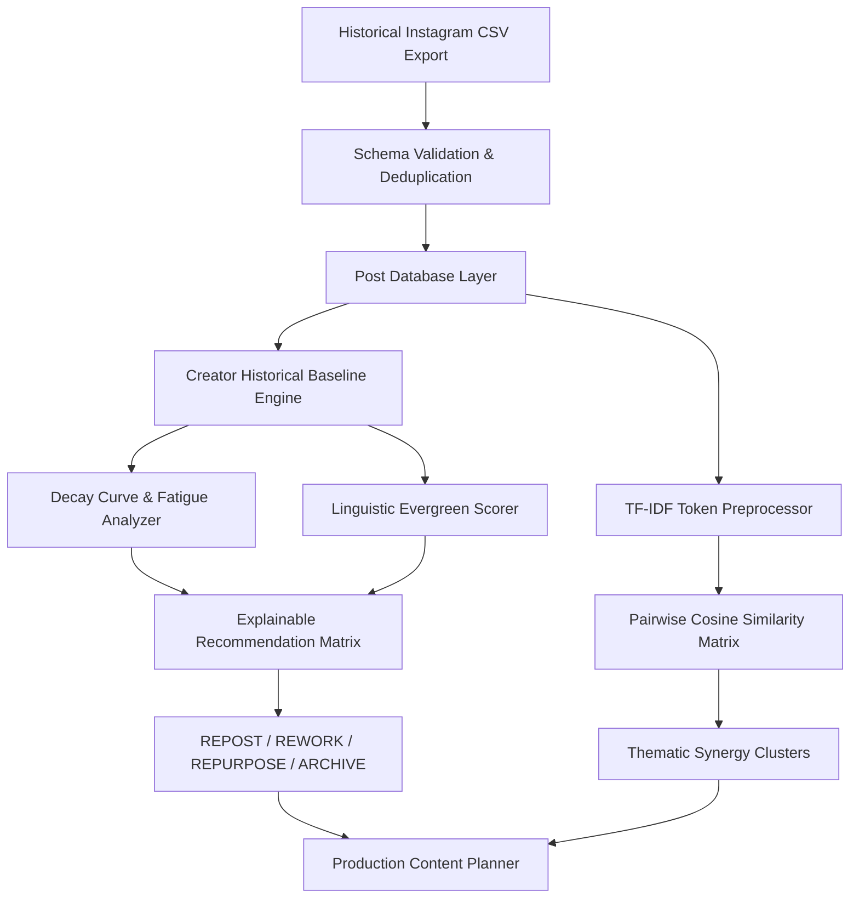

# Content Recycler 🔁⚡

> **AI-Powered Instagram Content Intelligence and Recycling Platform**  
> *Developed as a College-Level Showcase for Smart India Hackathon (SIH)*  
> **Theme**: Digital Media Automation, Creator Economy & Content Optimization  
> **Live Demo URL**: `http://localhost:5173` | **API Base**: `http://localhost:5000/api`

---

## 📌 Executive Summary & Problem Statement

Independent creators and social media teams face severe creative burnout trying to publish daily original content. Meanwhile, **80% of a creator's evergreen historical content decays within 24 to 48 hours** due to algorithmic feed churn—even though newer followers have never seen it.

Existing tools either:
1. Require expensive monthly subscriptions with paid AI API credits ($50+/mo), or
2. Force manual spreadsheet tracking without statistical intelligence or feed safety checks.

**Content Recycler** is a full-stack, zero-cost social media intelligence platform that ingests historical Instagram export data, calculates creator-specific statistical baselines, measures audience fatigue curves, and automatically categorizes content into four tactical actions:
- 🔁 **REPOST**: Proven evergreen high-performer dormant for $>60$ days. Re-share with near-zero effort.
- 🛠️ **REWORK**: High algorithmic reach but low conversion (weak hook or call-to-action). Re-script the opening 3 seconds.
- 🔄 **REPURPOSE**: High-bookmark static post (Image/Text) primed to convert into a high-retention short Reel or educational Carousel.
- 📦 **ARCHIVE**: Time-bound announcements, expired discounts, or below-baseline posts retired from rotation.

In addition, a built-in **zero-cost pure JavaScript NLP engine (TF-IDF & Cosine Similarity)** discovers conceptual clusters across historical captions to propose synergistic **"Mega Carousel" bundles**.

---

## 🛠️ Tech Stack & Engineering Decisions

| Layer | Technologies | Justification |
| :--- | :--- | :--- |
| **Frontend** | React 19, Vite, Tailwind CSS | Lightning-fast HMR, dark charcoal (`#070A0F`) & lime-green (`#A3E635`) modern SaaS aesthetic. |
| **Data Viz** | Recharts | Responsive SVG charts for historical reach/engagement trends and media distribution. |
| **Backend** | Node.js, Express (ES Modules) | High-throughput non-blocking asynchronous REST API with modular controllers and routers. |
| **Database** | MongoDB Atlas + Mongoose | Schema-enforced document storage with an automatic **In-Memory Fallback Mode** so the project runs out-of-the-box even without active cloud credentials during live hackathon demos. |
| **Security** | JWT, bcryptjs | Stateless authorization with HTTP bearer tokens and salt rounds. |
| **Ingestion** | Multer, Streaming `csv-parser` | Live field validation, schema normalization, and duplicate record detection. |
| **AI / NLP** | Pure JS TF-IDF & Cosine Vectorizer | **Zero-cost, privacy-first, explainable AI** with zero dependency on paid OpenAI/Anthropic API keys. |

---

## 📐 Mathematical & Algorithmic Formulation



### 1. Weighted Engagement Rate ($ER_i$)
Because the Instagram algorithm prioritizes bookmarks (saves) and direct messages (shares) over passive double-taps:
$$\text{Engagement Rate } (ER_i) = \frac{\text{Likes}_i + \text{Comments}_i + (\text{Shares}_i \times 1.5) + (\text{Saves}_i \times 2.0)}{\max(\text{Reach}_i, 1)} \times 100$$

### 2. Statistical Baseline & Z-Score Normalization
Every creator has a distinct audience size. Content Recycler normalizes each post against the creator's personal history:
$$\mu_{ER} = \frac{1}{N}\sum_{i=1}^N ER_i, \quad \sigma_{ER} = \sqrt{\frac{1}{N}\sum_{i=1}^N (ER_i - \mu_{ER})^2}$$
$$Z_i = \frac{ER_i - \mu_{ER}}{\sigma_{ER}}$$

### 3. Audience Fatigue & Decay Function ($D_i$)
To prevent audience irritation from premature reposting, a half-life threshold is enforced:
$$D_i = \begin{cases} 
0.20 & \text{if } T_i \le 14 \text{ days (High fatigue)} \\
0.20 + 0.60 \times \left(\frac{T_i - 14}{T_{\text{dormant}} - 14}\right) & \text{if } 14 < T_i < T_{\text{dormant}} \\
\min\left(1.0, 0.80 + \frac{T_i - T_{\text{dormant}}}{100}\right) & \text{if } T_i \ge T_{\text{dormant}} \text{ days (Feed fresh)}
\end{cases}$$
*(Default $T_{\text{dormant}} = 60$ days, customizable in Creator Settings).*

### 4. Zero-Cost NLP Similarity Engine (TF-IDF + Cosine Distance)
1. **Preprocessing**: Regex normalization, token stemming (e.g. `optimizing` $\to$ `optim`), stop-word removal (including social noise: `link`, `bio`, `swipe`).
2. **Term Frequency**:
   $$TF(t, d) = \frac{f_{t, d}}{\sum_{t' \in d} f_{t', d}}$$
3. **Inverse Document Frequency**:
   $$IDF(t, D) = \ln\left(1 + \frac{|D|}{1 + |\{d \in D : t \in d\}|}\right)$$
4. **Pairwise Vector Cosine Similarity**:
   $$\text{Sim}(d_A, d_B) = \frac{\vec{V}_A \cdot \vec{V}_B}{\|\vec{V}_A\|_2 \times \|\vec{V}_B\|_2}$$
5. **Graph Clustering**: Posts with $\text{Sim} \ge \tau$ form connected components proposed as **Multi-Slide Masterclass Carousels**.

---

## 🚀 Key Modules & System Capabilities

### 1. 📊 Analytics & Recycling Dashboard
- Real-time summary cards: Total Ingested Posts, Cumulative Reach, Mean ER, Prime Recycling Candidates.
- Interactive Recharts Area Chart displaying reach trends across historical publishing dates.
- Format portfolio breakdown (Carousels vs Reels vs Single Images vs Videos).
- High-intent bookmark performers with direct one-click recycling inspection.

### 2. 🗃️ Historical Content Library
- Interactive multi-parameter search (filter by caption text or `#hashtag`).
- Format filter pills (`ALL`, `CAROUSEL`, `REEL`, `IMAGE`).
- Sorting by Newest, Oldest, Highest Reach, Most Saves, or Highest ER.
- Responsive post cards displaying granular performance metrics and calculated ER badges.

### 3. 📥 CSV Data Ingestion & Live Deduplication Engine
- Drag-and-drop CSV upload dropzone.
- Automatic column mapping (`caption`, `mediaType`, `postDate`, `reach`, `likes`, `comments`, `shares`, `saves`).
- Live preview table highlighting Valid, Duplicate, and Invalid rows.
- Duplicate detection by both Post ID and identical caption content.
- **1-Click "Load 50 Demo Posts" Button** for instantaneous jury demonstrations.
- Downloadable sample CSV template (`sample_instagram_data.csv`).

### 4. 🧠 Explainable Recommendation Engine
- Clear categorical tabs: `REPOST`, `REWORK`, `REPURPOSE`, `ARCHIVE`.
- Transparent **Composite Opportunity Index (0–100)**.
- **Score Breakdown Modal** visualizing:
  - Engagement Performance Z-Score
  - Feed Freshness & Dormancy Safety Meter
  - Evergreen Topic Propensity
  - Format Repurposing Potential
  - Algorithmic Diagnosis ("Why this post?")
  - Tactical Creator Playbook ("What to do next")
- Direct one-click scheduling from diagnosis into the Content Planner.

### 5. 🕸️ Thematic Similarity & Carousel Bundler
- Dynamic similarity sensitivity slider (15% to 55%).
- Automated cluster grouping: Combines related single posts into comprehensive 10-slide guides with aggregated historical reach.
- Pairwise comparison cards showing overlap percentage and shared keyword badges.
- One-click bundle export to the production planner.

### 6. 📅 Production Content Planner
- Kanban Board view (`Draft` $\to$ `Scheduled for Production` $\to$ `Recycled & Published`).
- List view toggle with in-place format and status dropdowns.
- Detailed item editing: assign planned dates, customize revised hook copy, and record production notes.

### 7. ⚙️ Creator Settings & Baseline Customizer
- Creator profile context: Instagram handle, content niche, follower count, and bio.
- Interactive sliders for algorithmic weights:
  - Saves Weight Multiplier (1.0x to 4.0x)
  - Shares Weight Multiplier (1.0x to 3.0x)
  - Dormancy Threshold (30 to 120 days)
- Live database diagnostics displaying persistence mode, total posts, and system health.

---

## 💻 Quick Start & Setup Guide

### Prerequisites
- **Node.js**: v18.0.0 or higher (Tested on Node v24)
- **npm**: v9.0.0 or higher
- *(Optional)* **MongoDB Atlas URI** (System includes automatic in-memory fallback)

### Step 1: Clone or Navigate to Project
```bash
cd content-recycler
```

### Step 2: Install Dependencies
```bash
# Install backend dependencies
cd backend
npm install

# Install frontend dependencies
cd ../frontend
npm install
cd ..
```

### Step 3: Configure Environment Variables (Optional)
A pre-configured `.env` is already present. To point to a live MongoDB Atlas cluster, edit `backend/.env`:
```env
PORT=5000
MONGODB_URI=mongodb+srv://<username>:<password>@cluster0.mongodb.net/content_recycler?retryWrites=true&w=majority
JWT_SECRET=super_secret_sih_hackathon_jwt_key_2026_xyz
```
*(If `MONGODB_URI` is omitted or offline, the server gracefully activates its In-Memory Demo Engine so the app never crashes during evaluation).*

### Step 4: Run the Application
In terminal 1 (Backend):
```bash
cd backend
node server.js
```
*Backend runs at `http://localhost:5000`*

In terminal 2 (Frontend):
```bash
cd frontend
npm run dev
```
*Frontend runs at `http://localhost:5173`*

Open `http://localhost:5173` in your browser.

---

## 🎤 Smart India Hackathon (SIH) Jury Demonstration Script

Follow this 2-minute walkthrough during presentation:

1. **Sign-In & Baseline (0:00 - 0:20)**:
   - Click the green **"1-Click Hackathon Demo Access"** button.
   - Notice the status badge indicating 50 synthetic posts indexed and the creator handle `@arjun_codes`.
2. **Dashboard Analytics (0:20 - 0:45)**:
   - Show the **Creator Baseline ER** card (calculated with Saves & Shares weighted algorithms).
   - Point out the Recharts Reach Trend Area Chart and the 4-quadrant **Tactical Recycling Portfolio Split**.
3. **AI Recommendations & Explainability (0:45 - 1:15)**:
   - Click **"Recommendations"** in the sidebar.
   - Click on the **"Repost"** tab to highlight an evergreen post that has been dormant for $>120$ days.
   - Click **"Inspect & Schedule"** to open the **Score Analysis Modal**. Show the judges the explainable scoring bars (Engagement Z-Score, Freshness, Evergreen Confidence) and the algorithmic diagnosis.
   - Click **"Save to Content Planner"**.
4. **TF-IDF Thematic Bundler (1:15 - 1:40)**:
   - Navigate to **"Similarity Engine"**.
   - Show the **Thematic Synergy Clusters** (e.g., JavaScript Async + Event Loop posts combined into a 10-slide mega carousel).
   - Adjust the similarity slider to demonstrate real-time TF-IDF cosine recalculation.
5. **Content Planner & CSV Ingest (1:40 - 2:00)**:
   - Switch to **"Content Planner"** to show the scheduled post in the Kanban pipeline.
   - Move an item from `Scheduled` to `Recycled & Published`.
   - Briefly visit **"CSV Data Ingest"** and explain the schema validator and duplicate detector.

---

## 🛡️ Ethical Data & Synthetic Dataset Disclaimer

- **No Unauthorized Scraping**: This platform does not scrape Instagram, bypass private profile permissions, or violate Meta Platform Terms.
- **Ingestion via Creator Consent**: Content is ingested exclusively through user-provided CSV exports or creator-authorized data dumps.
- **Demonstration Dataset**: The included 50 records in `sample_instagram_data.csv` are realistic but **explicitly synthetic and simulated** for demonstration and hackathon judging.

---

## 👥 Authors & Acknowledgments

- **Project**: Content Recycler
- **Target Event**: Smart India Hackathon (SIH)
- **Stack**: React 19 • Vite • Tailwind CSS • Node.js • Express • Mongoose / MongoDB Atlas • Recharts
