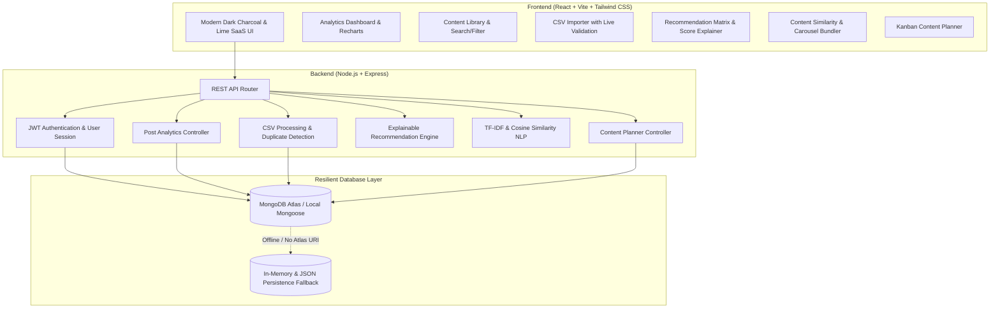

# Content Recycler — Architecture & Implementation Roadmap

> **Smart India Hackathon (SIH) Showcase Project**  
> **Domain**: AI-Powered Social Media Intelligence, Content Optimization, and Recycling  
> **Theme**: Creator Economy & Digital Media Automation

---

## 1. Executive Summary & Problem Context
Instagram creators frequently produce high-effort evergreen content that decays after 24–48 hours in user feeds due to algorithmic churn. Most creators either:
1. Re-post blindly, damaging audience retention, or
2. Suffer creative burnout constantly trying to create new content from scratch.

**Content Recycler** solves this by acting as an intelligent analytical companion. It ingests historical post analytics via CSV, computes creator-specific performance baselines, evaluates decay curves and evergreen potential, and classifies content into four actionable tactical buckets:
- 🔁 **REPOST**: High historical engagement + dormant (>60 days) + evergreen topic. Minimum effort, high projected reach.
- 🛠️ **REWORK**: Strong reach/views but below-average saves/comments (weak hook or call-to-action). Re-hook or update copy.
- 🔄 **REPURPOSE**: Single-image or text-heavy post that performed well, primed for conversion into a multi-slide Carousel or high-velocity Reel.
- 📦 **ARCHIVE / RETIRE**: Seasonal, outdated, or persistently underperforming content.

Furthermore, a built-in **zero-cost NLP Content Similarity Engine (TF-IDF + Cosine Similarity)** finds thematic clusters across historical posts to propose synergistic content bundles (e.g., merging 3 related coding tips into a 10-slide masterclass carousel).

---

## 2. System Architecture

---

## 3. Mathematical & Algorithmic Formulation

### 3.1 Creator Historical Baseline Metrics
For a creator with $N$ historical posts, the engagement rate for each post $i$ is calculated as:
$$\text{Engagement Rate } (ER_i) = \frac{\text{Likes}_i + \text{Comments}_i + \text{Shares}_i \times 1.5 + \text{Saves}_i \times 2.0}{\text{Reach}_i} \times 100$$
*(Weighted engagement heavily prioritizes Saves and Shares as key algorithmic signals).*

The creator's historical mean and standard deviation:
$$\mu_{ER} = \frac{1}{N} \sum_{i=1}^N ER_i, \quad \sigma_{ER} = \sqrt{\frac{1}{N} \sum_{i=1}^N (ER_i - \mu_{ER})^2}$$

### 3.2 Performance Z-Score & Relative Performance Ratio
$$Z_i = \frac{ER_i - \mu_{ER}}{\sigma_{ER}}, \quad \text{Ratio}_i = \frac{ER_i}{\max(\mu_{ER}, 0.001)}$$

### 3.3 Age & Decay Factor ($D_i$)
Content decay is evaluated using an inverted sigmoid/half-life function based on days elapsed $T_i$:
$$D_i = 1 - \frac{1}{1 + e^{-(T_i - T_{\text{dormant}})/\tau}}$$
Posts older than 60 days have high re-entry opportunity without feed fatigue.

### 3.4 Classification Rules
| Category | Decision Logic | Primary Action |
| :--- | :--- | :--- |
| **REPOST** | $Z_i \ge +0.5$ AND $T_i \ge 60$ days AND Evergreen Score $\ge 0.6$ | Re-publish original asset or subtle refresh |
| **REWORK** | $\text{Reach}_i > \mu_{\text{Reach}}$ BUT $ER_i < \mu_{ER}$ | Rewrite hook, upgrade caption, add engaging CTA |
| **REPURPOSE** | $Z_i \ge 0.0$ AND Format in (`IMAGE`, `TEXT_CAROUSEL`) | Adapt into short-form Reel or interactive Story sequence |
| **ARCHIVE** | $Z_i < -0.5$ OR Outdated / Event-specific keywords | Retire from active recycling queue |

### 3.5 Content Similarity Engine (TF-IDF + Cosine Similarity)
1. **Preprocessing**: Lowercase, regex punctuation removal, stop-word filtering (English + social hashtags), token stemming.
2. **Term Frequency ($TF(t, d)$)**:
   $$TF(t, d) = \frac{f_{t, d}}{\sum_{t' \in d} f_{t', d}}$$
3. **Inverse Document Frequency ($IDF(t, D)$)**:
   $$IDF(t, D) = \ln\left(1 + \frac{|D|}{|\{d \in D : t \in d\}|}\right)$$
4. **Cosine Similarity between Post $A$ and Post $B$**:
   $$\text{Sim}(A, B) = \frac{\vec{V}_A \cdot \vec{V}_B}{\|\vec{V}_A\| \|\vec{V}_B\|}$$
5. **Thematic Clustering**: Posts with $\text{Sim}(A, B) \ge 0.40$ are grouped into multi-post **Repurposing Clusters** (e.g. 3 high-affinity posts $\to$ "Thematic Carousel").

---

## 4. Implementation Phases

| Phase | Milestone | Deliverables |
| :--- | :--- | :--- |
| **Phase 1** | Foundation & Project Setup | Backend Express setup, resilience DB connection, Frontend Vite + Tailwind setup with dark theme palette. |
| **Phase 2** | Auth & User Context | JWT registration/login, password hashing, protected routes, user baseline settings. |
| **Phase 3** | Data Ingestion & Library | CSV upload endpoint with preview & duplicate check, 50 synthetic demo posts, search, filters, cards. |
| **Phase 4** | Recommendation Engine | Transparent analytical scoring, badge classification, explanation modals, baseline adjustments. |
| **Phase 5** | Similarity & Clustering | Zero-cost TF-IDF engine, topic clustering, Carousel bundler. |
| **Phase 6** | Content Planner & Polish | Kanban board (Draft / Planned / Published), calendar view, export schedule, README, demo script. |
